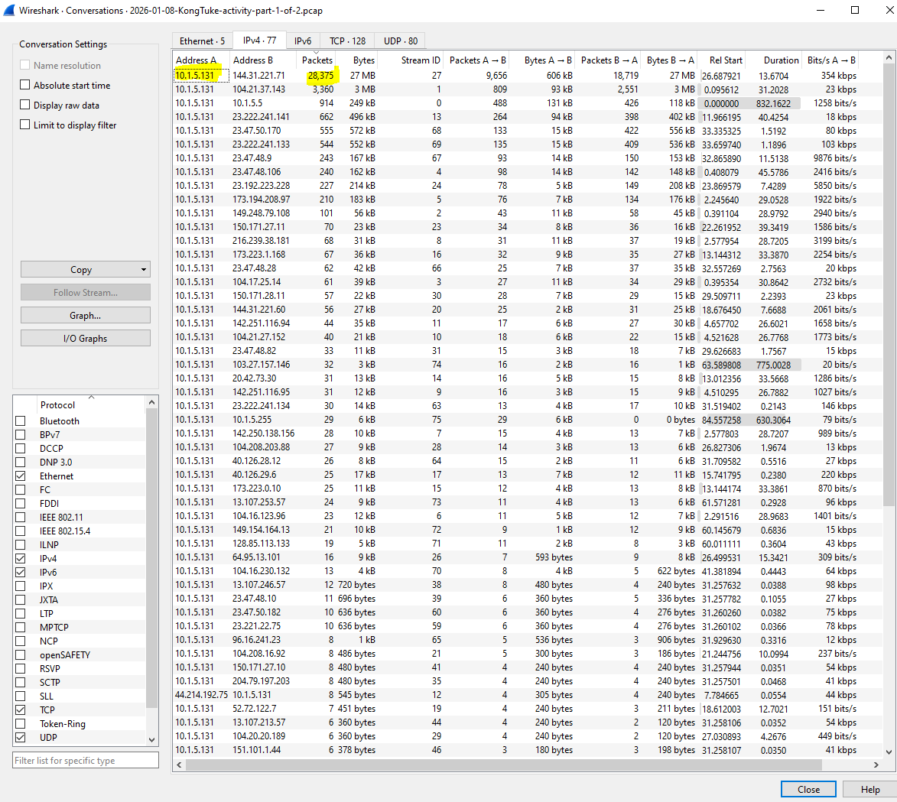
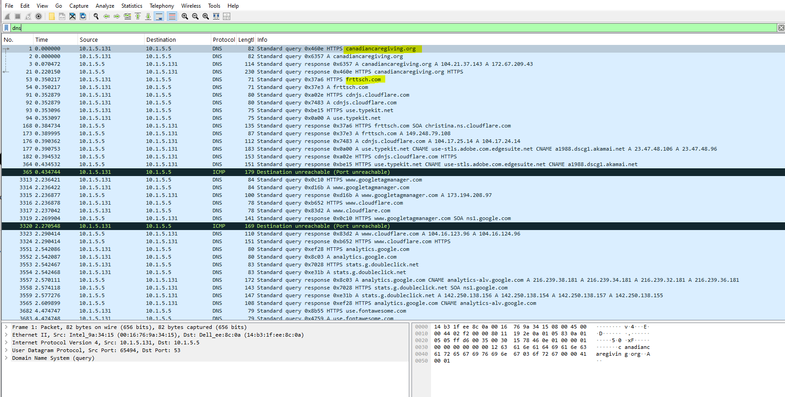
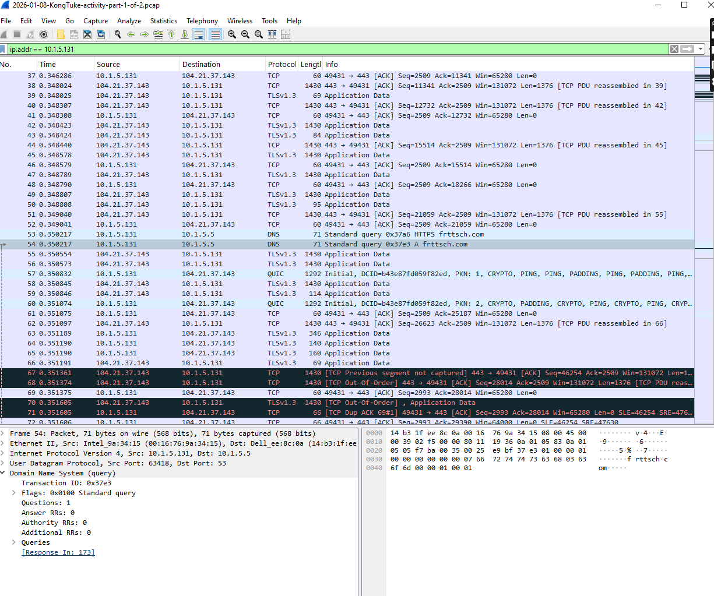
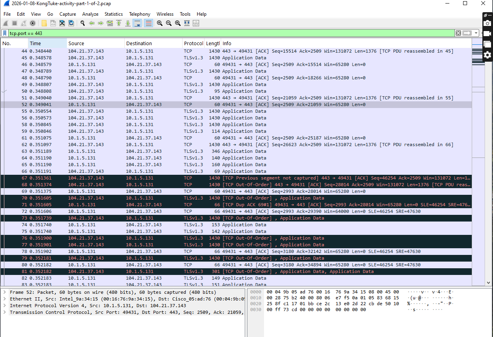
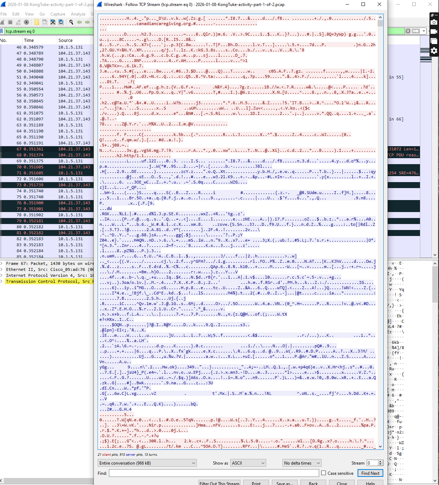

# Wireshark Incident Analysis (KongTuke Lab)

## 🔍 Summary
Analyzed packet capture using Wireshark to identify a compromised host, investigate DNS activity, and analyze encrypted HTTPS communication.

## 🧠 Key Findings
- Infected Host: **10.1.5.131**
- Suspicious External IP: **104.21.37.143**
- Domain: **canadiancaregiving.org**
- Protocol: **HTTPS (TLSv1.3)**

## ⏱ Attack Timeline
- DNS query to canadiancaregiving.org
- Connection established to 104.21.37.143 (TCP/443)
- Continuous encrypted TLS traffic observed

## 🚨 Indicators of Compromise (IOC)
- 10.1.5.131
- 104.21.37.143
- canadiancaregiving.org

## ⚠️ Analysis
Encrypted TLS traffic prevented payload inspection. Repeated communication suggests possible Command & Control (C2) activity.

### Conversations (Identify Infected Host)

### DNS Activity

### HTTPS Traffic

### TCP Stream (Encrypted)

### Additional Evidence

## 🛠 Tools Used
- Wireshark
- Network Traffic Analysis
